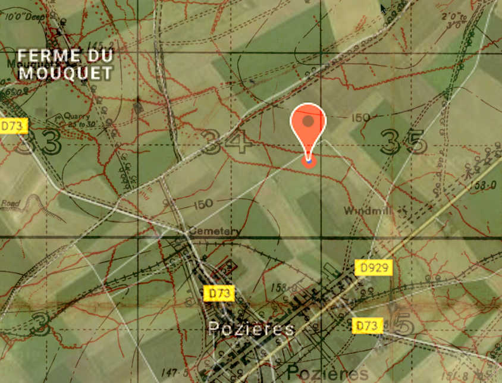
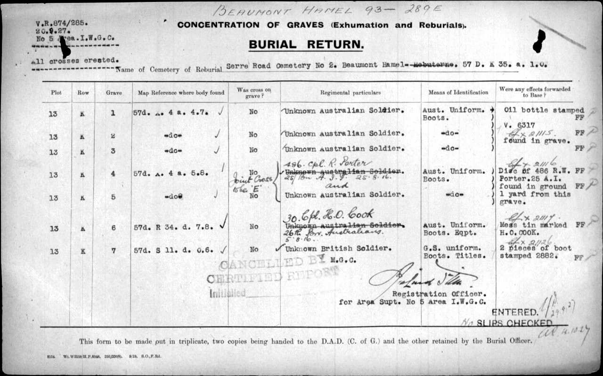

Harold Owen Cook
----------------
A Post Mortem
~~~~~~~~~~~~~
__By Owen Cook - A Grandson of Harold Owen Cook__

Introduction
^^^^^^^^^^^^

No 30, Corporal Harold Owen Cook was in the 7th Brigade attack on the heights of Pozieres which commenced at 9:15 pm in the evening of 4th Aug 1916. He was killed in this attack.

The objective of the attack was to seize the Windmill which was the highest point, as well as the Old German trench lines, OG1 and OG2. This objective was achieved. After the attack, maybe days afterwards, the dead were buried more or less in situ, in a shell hole perhaps. Owen's body was interred at a point between OG1 and OG2 trenches, which suggests he reached the objective. He was buried as an unknown soldier, presumably because his identity discs were destroyed with the rest of his body.

Just over eleven years later, he was exhumed, identified by his mess tins, and laid to rest in by the Commonwealth War Graves Commission in Serre Rd Nr 2 cemetery. 

After the Battle and Notification
^^^^^^^^^^^^^^^^^^^^^^^^^^^^^^^^^

A telegram was delivered to Owen’s wife, one Nellie Hutchinson (Crisfield) Cook. On the 9th September, this task fell to an Anglican priest, Arthur A Fellows. His book, Full Time, reads in part;

__In Rockhampton (as in other places) the evenings were somewhat dreaded by those whose duty it was to break the sad news of the death to parents, mothers, sweethearts and relatives of the men who had made the extreme sacrifice. There was a ray of hope concerning the wounded or even the missing. I shall not forger easily Theo. Kingel (mayor of Rockhampton at the time ) bringing me several telegrams one evening and asking me to take the ones he had to deliver himself, as he could not stand the strain of the interviews any longer. Incidentally, it fell to my lot to break the news of the death of Owen Cook to his widow who was associated with St Paul’s activities for many years. Mrs. Cook at the time we are speaking about, had her baby son (Owen) in her arms.__

Uncertainities
^^^^^^^^^^^^^^
Nellie wrote a letter to Owen in August of 1916 which was returned to her on the early March 1917. She wrote to the Officer in Charge of Base Records, Melbourne.

__... Last week I received a letter I had written to my husband last Aug and the envelope bore several initials and was endorsed “Wounded 9/10/16 JWM” and this has caused be some uneasiness as I received a cable on the 9th Sep- advising me that he had been killed in action in France on the 5th Aug 16. Yet the letter was endorsed “Wounded” 2 months after his reported death. As a few errors have occurred  I was wondering if this cable to me  was a mistake. Do you think it is probable, and if so, from whom should I get further information? I will be glad if you would please advise me by telegram for which I enclose 2/- ...__

On the 20th March, she received the telegram which read;

CABLE ADVICE CORPORAL HAROLD OWEN COOK KILLED IN ACTION FIFTH AUGUST SINCE CONFIRMED BY MAIL. ENDORSEMENT ENVELOPES UNRELIABLE

Nellie’s mother was Sarah O’Loan and there must still have been some doubt in the minds of the families as on the 13th July 1917, she wrote to Base Records with some incorrect detail;

__Can you give me any information regarding Lance Corporal No 30  25th Battalion who was reported killed in action August 5\textsuperscript{th} 1916 at Pozieres, as no particulars have ever come to hand and none of his things have ever been returned. Is there any doubt to his death. If there is any expense attached to these enqueries I will gladly meet it & may I ask you to treat this as a confidential matter.__

On the 19th July, Base records replied;

__... and have to state that there is apparently no doubt as to his death, as the final official confirming documents have been received, and that they show he was killed in action in France 5/8/16. Certain personal affects were received and transmitted to the registered next of kin on 28th May last ...__

Those Personal Effects
^^^^^^^^^^^^^^^^^^^^^^

Soldiers carried everything including their personal possessions. Before battle, un-essential items were stored in a knapsack and left with the "Q" section of the Battalion. In the event of death, these items were then returned to the next of kin.

It looks like the mother (Sarah) and Nellie may not have been in close contact, for on 2nd June 1917, Nellie signed for the personal effects which were;

* 2 handkcfs, 
* 3 Military Books 
* French and Arabic dictionary, Cards and a mirror

Insurance Claim
^^^^^^^^^^^^^^^

Owen had two small insurance policies, one with the Mutual Life Assoc and the other with the Colonial Mutual Life Assurance Society.  Nellie passed these to a solicitor, Hugh Grant for processing. There is an end note regarding this claim.

The Government also paid Nellie £200. Anecdotally,  the  matriarch Sarah O’Loan redistributed this money to “best suit the family”.

No death certificate had been issued at this stage, so written confirmation was requested of Base Records. The official Queensland Government death certificate, was issued on the 31st July 1922, number 1922/F/1810.

Medals
^^^^^^

Owen was awarded 1914/15 StarThe British War Medal and the Victory Medal.

Concentration of Graves
^^^^^^^^^^^^^^^^^^^^^^^
There is a letter on file dated 29th November 1927 from the International War Grave Commission to the Australian Graves Services advising;

_... in accordance with the agreement with the French and Belgian Governments to remove all scattered graves, and certain cemeteries which were situated  in places unsuitable for permanent retention, it has been found necessary to exhume the bodies buried in certain areas. In the process of exhumation the grave of the soldier named in the attached location sheet as noted below his name, and his remains were re-interred in the cemetery stated._

Below is an Map from tmapper.com positioning map reference _5d.R34.d.7.8._ which is overlaid on Google Maps (Pozieres).

:figure-caption: Logo

TheConcentration of  Graves Burial Return shows;

Owen, on being exhumed from this scattered grave, changed from being unknown soldier, to Cpl H O Cook of the 26th Bn because his mess tins were still with the body, and inscribed with his name, H O COOK. The re-internment was at the https://www.cwgc.org/find-a-cemetery/cemetery/67200/serre-road-cemetery-no.2/[CWGC] Serre Rd N2 Cemetery.

Follow Up
^^^^^^^^

On the 31st January 1928, Base Records wrote to Nellie;

__With further reference to the report of the regrettable loss of your husband, the late Nr 30 Corporal H.O.Cook, 26th Battalion, I am now in receipt of advice that, during the course of exhumation work in the vicinity of Pozieres, the Imperial War Graves Commission was successful in recovering the remains of this soldier which have since been interred with every measure of care and reverence in Plot 13, Row K, Grave 6 of Serre Road Cemetery No. 2, situated near Beaumont Hamel, France, where a permanent headstone of uniform design will be erected and engraved with his full regimental description and date of death, together with any verse or epitaph previously selected in the form of a personal inscription.__

__It is the practice of the Commission to notify relative direct when the headstones are finally in position, and at a later date the opportunity will be afforded you of obtaining a copy of the printed Register containing full particulars of all British and Dominion War Graves in the abovenamed cemetery.__

Email mailto:Owen.Cook@pcug.org.au[Owen Cook]

Some References
^^^^^^^^^^^^^^^

https://discoveringanzacs.naa.gov.au/browse/person/126121/[Discovering ANZACs Site +
https://www.awm.gov.au/collection/R1729061/[Cpl H O Cook's] AWM's Roll of Honour entry, it includes a photo.  + 
https://www.cwgc.org/find-war-dead/casualty/608412/cook,-harold-owen[CWGC] entry for Cpl H O Cook +
https://recordsearch.naa.gov.au/[Australian Archives] search facility. +
https://trove.nla.gov.au/list?id=136892[Vijay D'Souza's] thesis on the original A Coy of the 26th Bn. +
https://www.awm.gov.au/collection/U51466[The 1st AIF 26th Batallion] page at the Australian War memorial +
